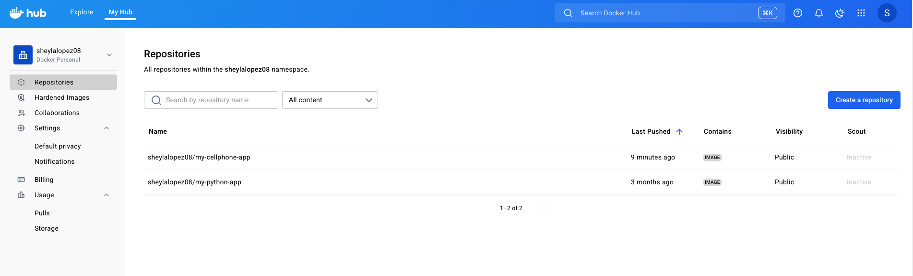

 # My Cellphone App / Mobile App Simulator 

## Table of contents: 

- [Navigate to the Application Directory](#navigate-to-the-application-directory)
- [Overview](#overview)
- [Docker Instructions](#Dockerinstructions)
- [Dockerfile Breakdown](#Dockerfilebreakdown)
- [Creating a Docker Repository](#Creating-a-Docker-Repository)
- [Start Colima](#Start-Colima) 
- [Pushing the Image to Docker Hub](#Pushing-the-Image-to-Docker-Hub)
- [Running Remote Images](#Running-Remote-Images)


## Navigate to the Application Directory

```bash
cd  Final Project /My Cellphone App/Part 2
```

## Overview

This part of the project contains the Docker configuration needed to containerize and run the Flask-based app that simulates a mobile environment.

## Docker Instructions

1. Build the Docker Image

Run the following command in this directory:

docker build -t my-cellphone-app .   

This will create a Docker image named my-cellphone-app.

2. Run the Docker Container

docker run -p 5000:5000 my-cellphone-app 

This will start the Flask app and expose it on http://localhost:5000.

## Dockerfile Breakdown

Here’s the breakdown of the provided Dockerfile:

```python
FROM python:3.10-slim
WORKDIR /app
COPY . /app
RUN pip install --no-cache-dir -r requirements.txt
EXPOSE 5000 8000
CMD ["python", "app.py"]
```


* **FROM python:3.10-slim**: 
Uses a lightweight version of Python 3.10 as the base image. The slim variant reduces image size by excluding unnecessary packages.

* **WORKDIR /app**: 
Sets the working directory inside the container to /app.

* **COPY . /app**: 
Copies all files from your current local directory (where you're building the image) into the /app directory inside the container.

* **RUN pip install --no-cache-dir -r requirements.txt**: 
Installs all Python dependencies listed in requirements.txt.
--no-cache-dir prevents pip from storing downloaded packages, keeping the image smal

* **EXPOSE 5000 8000**: 
Documents that the container will use ports 5000 and 8000.

* **CMD ["python", "app.py"]**: 
Specifies the default command to run when the container starts. In this case, it runs your Flask app using app.py.

## Final Objective

At the end of this part, you should accomplish the following: 


## Creating a Docker Repository 

A Docker Repository was created to stored, shared and managed My Cellphone App. 

Note: Colima/ Docker CLI & Python should be installed

## Steps: 

1. Log in to Docker Hub.
2. Navigate to the Repositories tab and click Create Repository.
3. Enter a name, set visibility (public/private), and click Create.

## Start Colima 

```python
colima start --runtime docker
```
## Pushing the Image to Docker Hub

 ## Verify the Local Image

 Run the following command to list local images:

 ```python
docker images
```
 ## Tag the Local Image

 Tag the image to match your Docker Hub repository name:

 ```python
docker tag my-cellphone-app:latest sheylalopez08/my-cellphone-app:latest
```

 ## Push the Image to Docker Hub

 1. Login to Docker Hub:

 ```python
docker login
```

2. Push the image:

```python
docker push sheylalopez08/my-cellphone-app:latest
```


## Running Remote Images

To run the pushed image on any other machine (with Docker):


```python
docker run --rm -it -p 5000:5000 sheylalopez08/my-cellphone-app:latest
```


Then go to:

http://127.0.0.1:5000/


